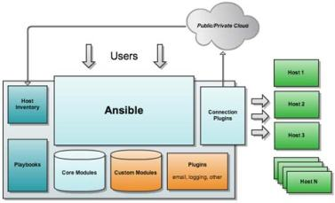
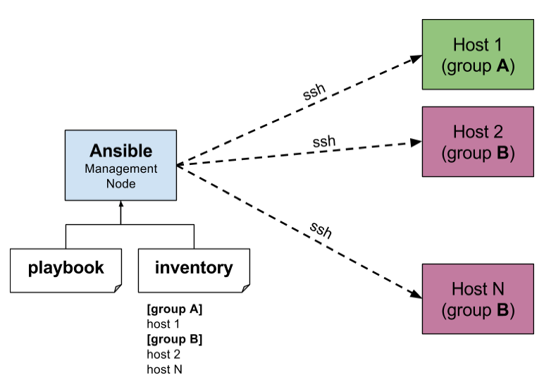
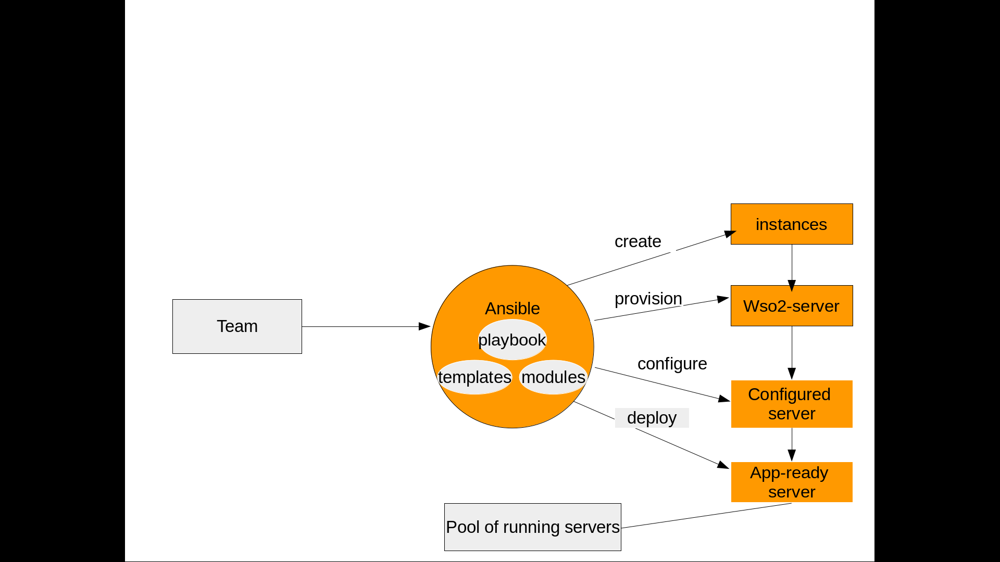

## WSO2 API Manager 2.2.0 
## Ansible Playbook

Ansible is a modern IT automation tool which makes our life easier by managing our servers for us . We just need to define the configuration in which we are interested and Ansible will go ahead and do it for us , be it installing a package or configuring a server application or even restarting a service . Ansible is always ready to manage our servers .
Read more information about ansible and its documentation  here.
Ansible manages machines in an agent-less manner . Ansible doesn’t have an additional security infrastructure, so it’s easy to deploy. And also we don't need to install anything on the client's end . However both push and pull mode are supported . It is a security focus tool . It uses OpenSSH as transport- protocol.
Ansible scripts commonly known as playbooks , are written in YAML and that allow you to describe your automation jobs in a way that approaches in plain English . 

The  Ansible playbook includes the installation and some  configurations such as  distributed database configuration, enable clustering, standalone h2 database configurations, API manager configuration, axis2 configuration, broker, user_manager configurations, Deploying WSO2 API-M  in a distributed setup  for WSO2 API manager.

**An Overview of Ansible Components**
The following are some of term definitions used elsewhere in the Ansible
- **Inventory**:A file (by default, Ansible uses a simple INI format) that describes Hosts and Groups in Ansible. Inventory can also be provided via an Inventory Script (sometimes called an “External Inventory Script”).
- **Playbook**:Playbooks are the language by which Ansible orchestrates, configures, administers, or deploys systems.
- **Module**:    Modules are the units of work that Ansible ships out to remote machines. Modules are kicked off by either /usr/bin/ansible or /usr/bin/ansible-playbook (where multiple tasks use lots of different modules in conjunction). Modules can be implemented in any language, including Perl, Bash, or Ruby – but can leverage some useful communal library code if written in Python. Modules just have to return JSON. Once modules are executed on remote machines, they are removed, so no long running daemons are used. Ansible refers to the collection of available modules as a library.

### How to Contribute
Supporting Operating System 
Ubuntu 16.04

Supporting Ansible Version
Ansible 2.4.3.0

### Instructions

**Install & Start Ansible**
The easiest way to install Ansible on a Debian or Ubuntu system is to use the official apt package.
        
        sudo apt-add-repository -y ppa:ansible/ansible
        sudo apt-get update
        sudo apt-get install -y ansible

Once Ansible is installed, make sure it’s working properly by entering ansible --version on the command line.
       
        ansible --version

**Generate SSH Public Key**
f you do not already have an SSH key pair that you would like to use for Ansible administration, we can create one now on your Ansible VPS.
        ssh-keygen
Do not type anything. Just press enter to continue.

        ssh-add ~/.ssh/id_rsa
        cd ~/.ssh/
        cp id_rsa.pub authorized_keys
        chmod 644 authorized_keys

Exit from the terminal and if you want to check again is SSH key is available or not then you 

        cd ~/.ssh

id_rsa is avialable in your terminal then you successfully set the SSH key.

**SSH Connection**
Ansible communicates with remote machines over SSH. It uses SSH to connect to servers and run the configured Tasks. While it certainly has the ability to handle password-based SSH authentication, SSH keys help keep things simple. 
By default, Ansible 1.3 and later will try to use native OpenSSH  for remote communication  when possible. Ansible , by default  assuming we’re using SSH keys. 
Ansible has a default inventory file (etc/ansible/hosts) are used to define which remote servers will be managing. Our public SSH key should be located in authorized_keys on remote systems.

**Inventory**
By default, Ansible looks for the inventory file at /etc/ansible/hosts. Inside the inventory file, name of group is enclosed in square brackets. Server names can be their DNS name or IP addresses.

		[webservers]
		10.100.4.205
		192.168.122.201

Once inventory hosts are listed, variables can be assigned to them in simple text files (in a subdirectory called ‘group_vars/’ or ‘host_vars/’ or directly in the inventory file.)

### Create the role Framework
Ansible roles are an optional feature to take advantage of, but if we plan on using Ansible extensively, it is highly recommended that you explore this functionality. Not only will it keep your host-level configuration clean and readable, it will also allow you to easily reuse code and implement your changes in a modular fashion.
Files Handlers Meta Templates Tasks Vars are the directories that will contain all of the code to implement our configuration. We don’t use all of the directories, so in real practice, we don’t need to create all of these directories.
This is what they are all for:
- **Files**:This directory contains regular files that need to be transferred to the hosts you are configuring for this role. This may also include script files to run.
- **Handlers**: All handlers that were in your playbook previously can now be added into this directory.
- **Meta**: This directory can contain files that establish role dependencies. You can list roles that must be applied before the current role can work correctly.
- **Templates**: You can place all files that use variables to substitute information during creation in this directory.
- **Tasks**: This directory contains all of the tasks that would normally be in a playbook. These can reference files and templates contained in their respective directories without using a path.
- **Vars**: Variables for the roles can be specified in this directory and used in your configuration files.
Within all of the directories but the "files" and "templates", if a file called main.yml exists, its contents will be automatically added to the playbook that calls the role.

### Configuration management with Ansible
Ansible templates directory is very useful for configuring the WSO2 API MANAGER with lots of changes per configuration files. It can also helpful when trying to build out a big extent configurations automatically by using dynamic / static variables inside  the vars directory.

When we want to make any changes in the wso2am-2.2.0 , in Ansible the customer go into /etc/ansible/roles/apim/vars and open the main.yml file via vim main.yml in the vim editor and make any changes which they want for their profile. The profiles of wso2am are mentioned in the Ansible script as  “api_store, api_publisher, traffic_manager, key_manager,  gateway” 

# Connect the database
Here we used the mysql database. That database was created in a machine and linked to the other machines.
Original machine had the database and it gave the permission to the other machine through this command
       
        Mysql -u root -p;
        ALTER USER ‘username’@’%’ IDENTIFIED BY ‘password’;
        Flush privileges;
        grant all on *.* to 'root'@'%';
        flush privileges;
The client accessed through the 
        
        mysql -h <IP_ADDRESS_OF_REMOTE_HOST> -u <USERNAME> -p
        Eg: mysql -h 10.100.4.205 -u root -p

Here the client also wanted to know the password of the mysql of the original.

